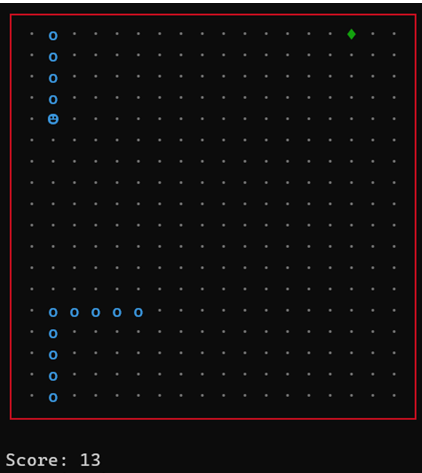

# Консольная игра "Змейка"
### Правила игры:
* Змейка - это классическая компьютерная игра, в которой игрок управляет змеей, которая перемещается по полю и собирает еду, при этом увеличивая свой размер.
* Цель игры состоит в том, чтобы достичь наибольшей длины змейки и не столкнуться со стеной (в зависимости от режима) или собственным хвостом. Благодаря этой игре человек развивает внимательность и скорость реакции.
* На экране консоли появляется постоянно движущаяся змейка, которая собирает «яблоки». Постепенно змейка растёт. По мере того, как она ест, размер её становится больше. Игроку всё сложнее управлять змейкой на поле игры.
* Игра заканчивается если змейка укусит сама себя или столкнется со стеной. Также игру можно закончить преждевременно нажав клавишу «Esc»
* Игрок управляет змеей с помощью стрелок на клавиатуре или с помощью клавиш «w a s d».
* Сложность игры зависит от размера поля и скорости змейки. Чем меньше поле и чем больше скорость тем сложнее.
* В данной программе реализовано два режима игры: со стенками и с прохождением серез стены. Пример игры с прохождением через стены представлен на рисунке
 
 
